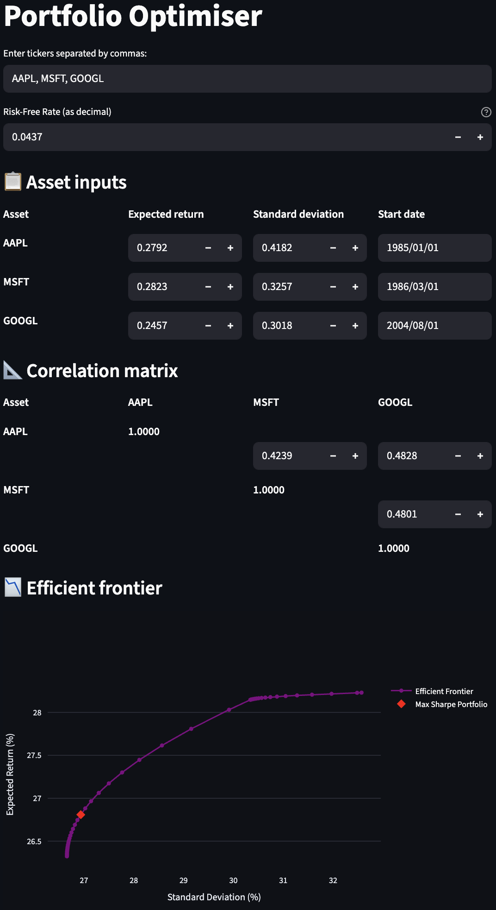

# Portfolio Optimisation

This application allows users to perform portfolio optimisation by computing the efficient frontier.

## Features

- Input stock tickers to fetch historical price data.
- Adjust expected returns and volatilities for each asset.
- Modify the correlation matrix between assets.
- Visualise the efficient frontier.
- View and download the portfolio weights for different points on the frontier.

## Screenshot



## How to run

1. Ensure you have Python and pip installed.
2. Install the required dependencies:
   ```bash
   pip install numpy pandas yfinance scipy streamlit plotly
   ```
3. Run the Streamlit application:
   ```bash
   streamlit run portfolio_optimiser.py
   ```

## License

This project is licensed under the MIT License - see the [LICENSE](LICENSE) file for details.
