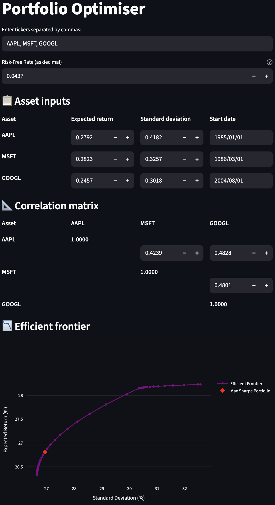

# Portfolio optimiser
A portfolio optimisation app based on Modern Portfolio Theory (MPT). It fetches
historical data for a set of tickers to pre-fill estimates for expected
returns, volatilities, and correlations. You can override any of those inputs
with your own forward-looking assumptions.

## What it does
Given:
- expected annual returns for each asset,
- annualised volatilities (standard deviations),
- a correlation matrix between assets,
the app computes a **long-only** (no short selling) efficient frontier and
highlights the maximum Sharpe ratio portfolio.

## Features
- fetch historical monthly prices via `yfinance` to pre-fill inputs,
- edit expected return, volatility, and correlations,
- edit per-asset start dates (used to slice historical data),
- efficient frontier plot with max Sharpe portfolio highlighted,
- optional portfolio weights table,
- export the computed frontier as CSV.

## How inputs are estimated from historical data
Historical data is only used to generate defaults:
- prices: monthly adjusted close (`auto_adjust=True`),
- returns: simple monthly returns (`pct_change()`),
- annual expected return: mean(monthly returns) × 12,
- annual volatility: std(monthly returns) × √12.

## Parameters
- **Expected return**: expected annual return (decimal). Example: `0.08` means
  8% per year.
- **Standard deviation**: annualised volatility (decimal). Example: `0.20`
  means 20% per year.
- **Correlation matrix**: pairwise correlations between asset returns.
- **Risk-free rate**: annual risk-free rate (decimal) used for Sharpe ratio:
  (return − risk-free rate) / volatility.

## Screenshot


## How to run
Assuming you have git, Python, and pip installed:
1. Clone the repo:
   ```bash
   git clone https://github.com/benthamite/portfolio-optimiser
   ```
2. Enter the directory:
   ```bash
   cd portfolio-optimiser
   ```
3. Install dependencies:
   ```bash
   pip install numpy pandas yfinance scipy streamlit plotly
   ```
4. Run the app:
   ```bash
   streamlit run portfolio_optimiser.py
   ```

## Notes and limitations
- The frontier is computed under long-only constraints (weights are bounded to
  `[0, 1]` and sum to 1), so results differ from unconstrained textbook
  examples.
- If you enter correlations that do not form a valid correlation matrix, the
  optimiser may fail or produce unexpected results.

## License
This project is licensed under the MIT License. See [LICENSE](LICENSE).
